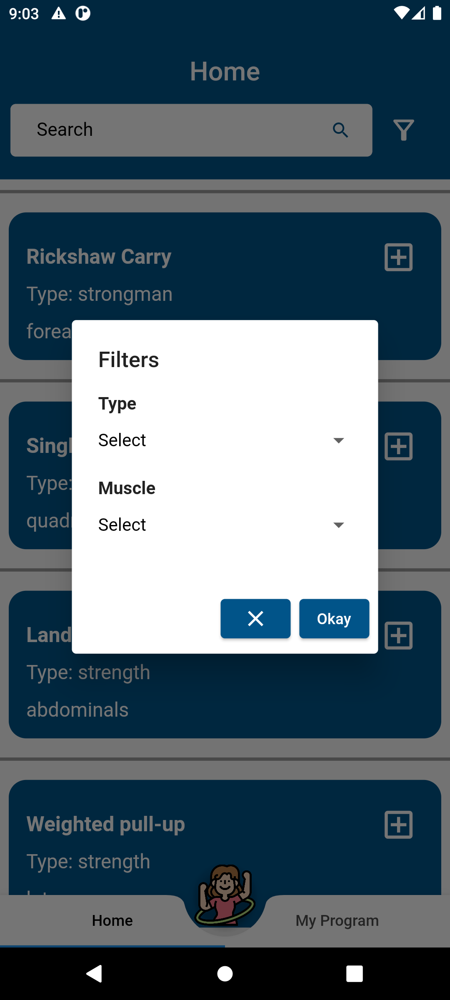

# Exercise Finder App

This project was developed using Model - View - View Model architecture.

Provider was preferred as the state management approach.

You can take a look at  <a href="https://github.com/erdemsaray"> my other projects<a> for the missing features of this app, which was developed in one day.

